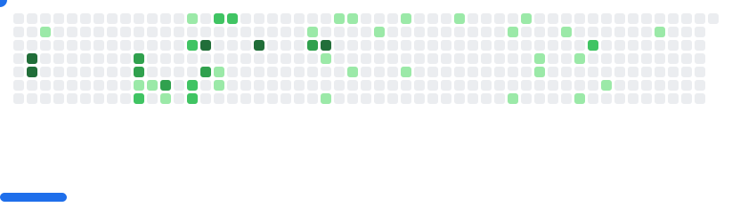

<!-- Top banner: clickable GIF that opens the MP4 -->

  

---

## 💫 About Me

- 👋 Backend-leaning full-stack dev. I build pragmatic web apps and contribute to OSS.
- 🔭 I’m currently learning **Go (Golang)**.
- 👯 Open to collaborating on useful, real-world OSS.
- 📫 Reach me: **tienanhnguyen999@gmail.com**
- ⚡ Fun fact: When I’m not coding, I collect **figurines**.

## 🌐 Socials

## 💻 Tech Stack

  
  
  
  
  
  
  
  
  
  

## 📊 GitHub Stats

  

## 🏆 GitHub Trophies

  

## ✍️ Random Dev Quote

  

---

  <picture>
    <source media="(prefers-color-scheme: dark)" srcset="images/breakout-dark.svg" />
    <source media="(prefers-color-scheme: light)" srcset="images/breakout-light.svg" />
    
  </picture>

  

